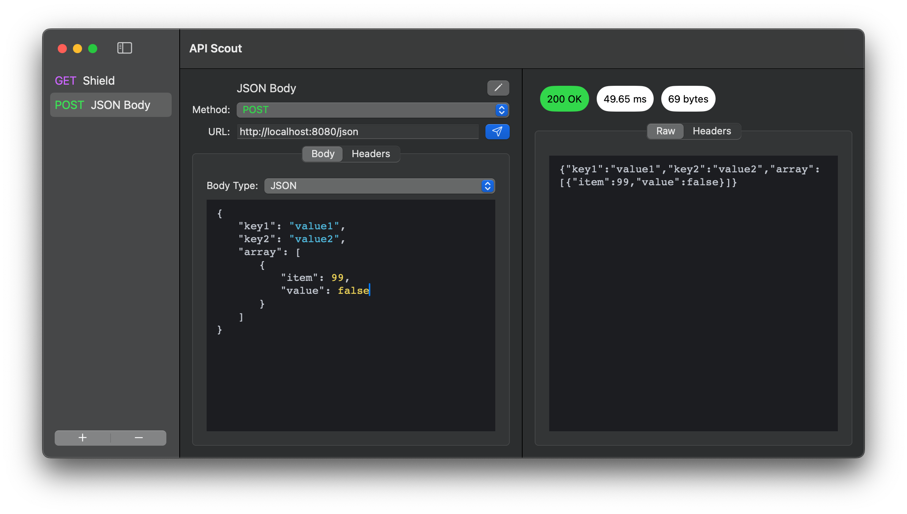
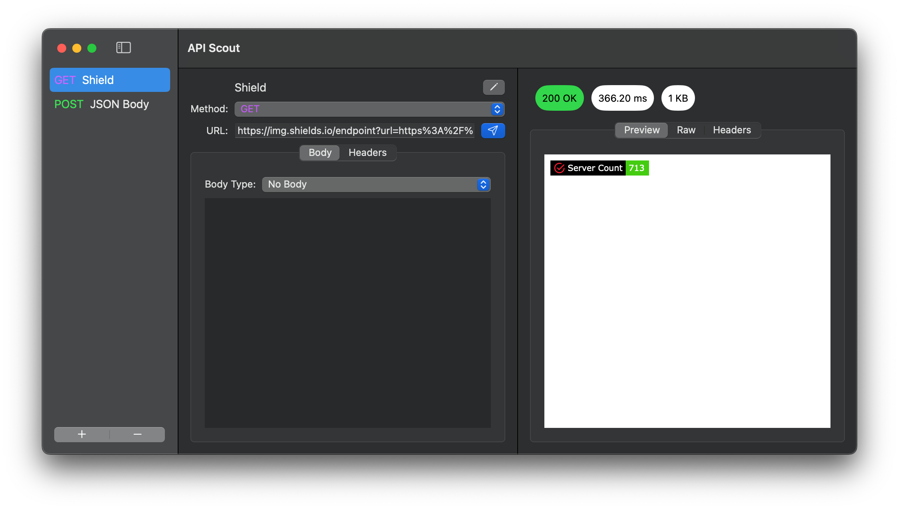

# API-Scout

A user-scale API testing tool built explicitly for the Mac in Swift. Currently handles a very minimal set of functionality and is not a terribly well-behaved app (for now).

This is both the first Mac App and the first Swift I have written. If you have interest in this product, please bear with me as I learn.

The data storage is all taken care of by SwiftData, and as much of the UI as possible is written with SwiftUI just because that's proven to be the simplest for 90% of what I want this app to do. Turns out [ATP](https://atp.fm/491) was right, SwiftUI is really great until you find something it can't do, and then it's back down to AppKit.[^1]

## Planned Additions & Improvements

- [ ] State management
  - [x] Creating/destroying requests
  - [x] Duplicating requests
  - [x] Persisting requests between restarts (🤦)
  - [x] Request multi-selection[^2]
  - [ ] [Request folders](https://developer.apple.com/documentation/swiftui/list#Creating-hierarchical-lists)
  - [ ] Request import/export (probably just to & from json but maybe cURL too)
  - [ ] User Preferences
    - [x] Editor themes
    - [ ] Editor bracket/quote auto-close
    - [x] Light/dark themes
  - [x] Also just make the state management not terrible to read maybe, there's a thought [^3]
- [ ] Requests
  - [x] Custom headers & header editor
  - [ ] Query param editor
  - [x] Editor highlighting based on selected body type
  - [x] Encoding based on `Content-Type` header (Still more options to support, but functions)
  - [ ] `User-Agent` header
  - [ ] Request timing
  - [ ] Auth
    - [ ] Bearer
    - [ ] Basic
    - [ ] Custom key
    - [ ] Digest
    - [ ] OAuth 1.0
    - [ ] OAuth 2.0 (probably)
  - [ ] More request body types
    - [ ] XML
    - [ ] YAML
    - [ ] Forms
    - [ ] Custom
    - [ ] GraphQL (maybe)
- [ ] Responses
  - [ ] Auto formatting
  - [x] Decoding based on `Content-Type` header (again, still more options to support, but functions)
  - [x] Rendering HTML from response body
  - [x] Rendering SVG from response body
  - [ ] Copy header items directly to clipboard
- [ ] Environment
  - [ ] Variables
  - [ ] Variable groups
- [ ] Cookies (maybe??)
- [ ] Better UI 😰

This isn't an exhaustive list – though it is an exhausting list to write (ba dum tiss) – it's just the things I can think of off the top of my head that probably belong in either of A) a well behaved Mac App, or B) An API testing App.

I can also tell already there will be some things I'd like to implement that are just impractical or not feasable.[^4] For cases like that, I'll probably make a note of them here and come back to them if I ever want to dive down any of those particualr rabbit holes.

[^1]: Anyone know a good resource for learning AppKit and how the hell custom `NSViewRepresentable`s work?

[^2]: All In the name of getting folders going Someday™

[^3]: The state management is a damn sight better than it was previously so I'll count it as a win for now. I reserve the right to be wrong about that later when I know what I'm doing a little better. Also there's a 60% chance adding folders totally wrecks my state management so we'll see how that goes.

[^4]: For example, a `GET` with a body; I know it's not *technically* in spec for HTTP to allow that, but I've worked personally with some poorly behaved APIs that require just that. Unfortunately, the `URLSession` system prohibits `GET`s with a body, so I'd have to do a lot of extra work integrating a substitute network stack like AlamoFire to get there. Doesn't feel worth it, but if I hear a lot of feedback that it would benefit people, I would consider finding a solution to add it.
